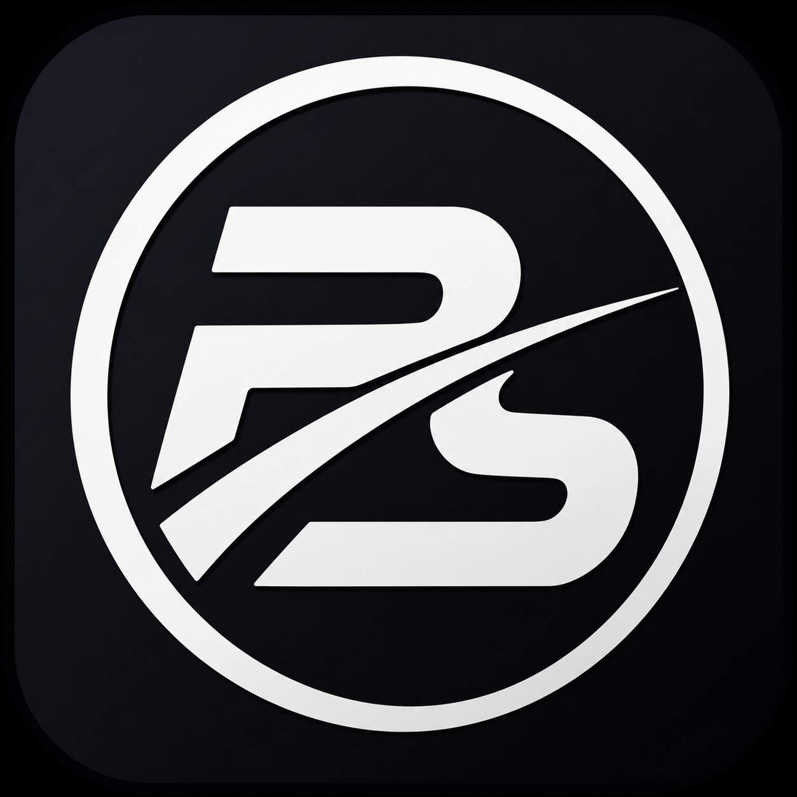

<p align="center">
  
</p>

<h1 align="center">BimmerStein ECU Tool</h1>

<p align="center"><strong>BMW MS41 Programming, Diagnostics, and Recovery</strong></p>

<p align="center">
  Windows desktop software for BMW MS41 programming, diagnostics, calibration work, and recovery.
</p>

<p align="center">
  <strong><a href="https://github.com/CAATZ/BimmerStein-ECU-Tool/releases/tag/v0.1.0b10">Download Beta 10</a></strong>
  &nbsp;&middot;&nbsp;
  <a href="manual/USER_MANUAL.md">User Manual</a>
  &nbsp;&middot;&nbsp;
  <a href="https://github.com/CAATZ/BimmerStein-ECU-Tool/issues">Issues &amp; Feedback</a>
</p>

<p align="center">
  <code>Windows x64</code>&nbsp;&nbsp;
  <code>BMW MS41 focused</code>&nbsp;&nbsp;
  <code>GPL-3.0-only</code>
</p>

---

<p align="center">
  <strong>OFF-ROAD USE ONLY</strong>
</p>

## Overview

BimmerStein ECU Tool brings BMW MS41 flashing, diagnostics, configuration, patching, and recovery together in a single Windows application:

- Read and write 256 KB full ROMs and 24 KB tune files.
- Automatically select Soft-BSL, stock native-fast DS2, or normal DS2.
- Correct the applicable MS41 checksums before flashing.
- Honor the operator's backup and host read-back Verify selections.
- Preserve an active recovery session after a post-erase write failure.
- Read ECU information, DTCs, live data, coding, VIN, and EWS information.
- Analyze ROMs with user-managed definitions and a detachable parameter table.
- Convert, catalogue, and patch ROM images offline.
- Install and use Soft-BSL for supported high-speed operations.
- Recover an unbootable ECU through the separate hardware-BSL workflow.

The supported release target is **Windows x64**. PyInstaller and Nuitka builds are distributed as
per-user installers and complete portable packages. The PyInstaller executable must remain beside
its `_internal` directory; the Nuitka build uses a flat application folder. The required Visual C++
runtime is included in every Windows package, so no separate runtime installation is required.

## Safety

> [!IMPORTANT]
> **OFF-ROAD, COMPETITION, RESEARCH, AND BENCH USE ONLY.** Do not use this software to modify a
> vehicle operated on public roads. The user is responsible for compliance with applicable
> emissions, safety, registration, and other laws.

> [!CAUTION]
> ECU programming can leave an ECU unbootable if power, wiring, or communication is interrupted.
> Use a stable regulated power supply, confirm the target file and flash geometry, and keep a
> hardware-BSL recovery path available for advanced work.

If a write fails after erase begins, **keep ignition ON, leave the adapter connected, and keep the
application open**. Use **Retry Flash Recovery** while the retained native-fast or Soft-BSL session
is available.

After a successful Flash-tab write, follow the displayed ignition procedure: ignition OFF, wait at
least 10 seconds, then ignition ON.

## Supported workflows

| Area | Scope |
| --- | --- |
| ECU software | BMW MS41.0, MS41.1, MS41.2, and MS41.3 |
| Normal diagnostics | BMW DS2 over K-Line, 9600 baud, 8E2 |
| Stock fast transfer | Native-fast DS2 through FTDI D2XX, requesting the ECU-exact 187,500 baud rate |
| Soft-BSL | Persistent loader and Intel/AMD RAM agents |
| Hardware BSL | Intel 28F200 and AMD/JEDEC 29F200/29F400 through a separate direct ASC0 connection |
| Image sizes | 256 KB full ROM and 24 KB tune |

Hardware-BSL and armed Soft-BSL boot-region operations are advanced recovery-sensitive workflows.
Intel 28F200 erase/program also requires the correct external VPP/RP# supply; AMD/JEDEC parts do
not use that Intel programming-voltage requirement.

For the bench wiring and hardware connections used by the BSL-Unbricker tab, see
[CAATZ/MS41-BSL-Unbricker](https://github.com/CAATZ/MS41-BSL-Unbricker).

## Soft-BSL: persistent high-speed ECU access

Soft-BSL is one of the primary features of BimmerStein ECU Tool. It installs a small persistent
loader in ECU flash using the guided installation workflow. When requested, that loader accepts
the matching Intel or AMD/JEDEC agent over the existing DS2 K-Line connection, loads it into ECU
RAM, and transfers control to it for higher-speed reads and writes. No separate bench connection is
required for normal Soft-BSL operation after installation.

The installer identifies the ECU and flash family, validates and prepares the target image, creates
the temporary installation entry, writes and verifies the persistent loader, and confirms normal
DS2 communication after the guided ignition sequence. The temporary entry is removed after a
successful installation; subsequent operations use the persistent loader and the current bundled
RAM agents.

Once detected, Soft-BSL is selected automatically by the Flash tab. It supports optimized full-ROM
and tune reads and writes, starts at the highest supported baud tier, and can retry a lower tier only
before erase begins. If a write fails after erase may have started, the application retains the live
RAM-agent session and prepared image for a same-session recovery attempt instead of reopening the
port or changing transports.

> [!WARNING]
> Soft-BSL installation modifies ECU firmware and is recovery-sensitive. Use stable power, follow
> every ignition prompt exactly, do not interrupt an active write, and keep a hardware-BSL recovery
> path available. Golden-bank, cross-bank, and armed boot-region operations are advanced workflows,
> not routine substitutes for normal tune or program writes.

## Live data and logging

The Live Data tab displays and records core MS41 engine values, including RPM, temperatures,
throttle position, airflow, ignition and knock values, VANOS position, injector pulse width, fuel
trims, load, battery voltage, oxygen-sensor and MAF voltages, and operating states. When the MS41.3
wideband feature is enabled, the tab automatically adds actual AFR, target AFR, the selected
wideband input voltage, and narrowband-emulation status.

The RAM addresses and conversions are built-in, ECU-specific profiles derived from RomRaider MS41
logger definitions. The connected ECU ID selects the appropriate address family; values without a
verified mapping remain unavailable instead of using a guessed address. These profiles are part of
the application—the Live Data tab does not import user-selected logger-definition XML files.

**Fast Telegram Mode** registers up to 24 RAM addresses and retrieves them together through one DS2
batch request for the best practical sample rate. If batch polling is unsuitable for an ECU or
connection, **Standard Mode** reads the same mapped values through smaller grouped DS2 RAM requests.
Optional CSV logging writes timestamped sessions to the portable application's `logs/` directory.
Live Data polling is read-only with respect to ECU flash memory.

## Transfer behavior

Normal Flash-tab reads and writes select one route:

1. Soft-BSL when a compatible persistent loader is available. It starts at the highest supported
   tier and retries lower Soft-BSL tiers only while the operation remains pre-erase.
2. Stock native-fast DS2 on a compatible stock ECU through D2XX. If its pre-erase high-rate check
   fails after the ECU is confirmed back at normal state, the complete operation restarts over
   normal DS2 at 9600.
3. Normal DS2 at 9600 when neither accelerated route is available.

Rate or route fallback is allowed before erase only. Once erase may have started, the active session
and prepared target are retained for same-session recovery instead of reopening the port or changing
transports.

The Flash tab does not enforce a backup or host read-back verification. **Back up before write** and
**Verify flash after write** follow the operator's selections. ECU-side finalization remains part of
every successful DS2 write and is separate from optional host byte-for-byte verification.

## Firmware patches

The Patches tab detects installed and deprecated revisions, validates dependencies and byte
collisions, corrects checksums, and archives the composed image in Bins.

> [!WARNING]
> **HIGHLY EXPERIMENTAL — UNTESTED.** Ignition Cut V7, current Launch Control, and AlphaN
> MAF-failsafe are currently untested
> and may work incorrectly or may not work at all. Unexpected engine behavior, stalling, failure to
> limit RPM, or other unintended results are possible. Test only in controlled off-road or bench
> conditions, begin conservatively, monitor the engine closely, and keep a verified stock image and
> recovery path available. Do not rely on either patch for engine protection or any safety-critical
> function.

The Patches tab labels these revisions **UNTESTED**. Deprecated field revisions, including
non-working Ignition Cut V6, remain detectable and remove-only so an older installation can still be
removed safely during migration.

Every Windows package includes `BimmerStein MS41 Patch Definitions.xml` beside the executable for
RomRaider or BimmerStein Tuning Suite. It covers the calibration items introduced by supported
patches; install the matching firmware patch before editing those tables and verify the ECU variant,
calibration ID, and patch revision. A mismatched definition can expose incorrect tables or write to
the wrong calibration addresses.

## Installation

1. Download either versioned Windows x64 installer, or its corresponding complete portable ZIP.
2. Run the installer; it installs for the current user without requiring administrator access and
   offers an optional desktop shortcut.
3. For portable use, extract the complete ZIP and keep the entire application folder together.
4. Assets containing `-Nuitka` use the Nuitka backend and install under a distinct product identity
   so both builds can coexist. Report the selected backend when describing a packaging problem.
5. Install the driver for the intended FTDI adapter, then run `BimmerStein ECU Tool.exe`.

D2XX is preferred for native-fast DS2, Soft-BSL, and hardware BSL. Normal DS2 and supported
hardware-BSL paths can use pyserial where the optimized D2XX path is unavailable.

User-generated data is stored beside the executable in either installation mode:

- `backups/` contains reads, prepared images, and recovery files.
- `logs/` contains session diagnostics.

Full ROMs and logs can contain VIN and ECU identity information. Treat them as private.

## Documentation and support

The illustrated manual covers normal flashing, recovery behavior, Soft-BSL, hardware BSL,
diagnostics, offline tools, patches, and final checklists:

- [Download BimmerStein ECU Tool 0.1.0 Beta 10](https://github.com/CAATZ/BimmerStein-ECU-Tool/releases/tag/v0.1.0b10)
- [Illustrated PDF manual](output/pdf/BimmerStein-ECU-Tool-User-Manual.pdf)
- [User manual (web-readable Markdown)](https://github.com/CAATZ/BimmerStein-ECU-Tool/blob/main/manual/USER_MANUAL.md)
- [Build and release instructions](https://github.com/CAATZ/BimmerStein-ECU-Tool/blob/main/BUILDING.md)
- [Beta release notes](RELEASE_NOTES.md)
- [Patch definitions and usage](https://github.com/CAATZ/BimmerStein-ECU-Tool/blob/main/engines/patcher/romraider/README.md)
- [Hardware-BSL recovery companion](https://github.com/CAATZ/MS41-BSL-Unbricker)
- [BimmerStein Tuning Suite](https://github.com/CAATZ/bimmerstein-tuning-suite)
- [Third-party notices](THIRD_PARTY_NOTICES.md)
- [GNU GPL license](LICENSE)
- [Report a bug or request a feature](https://github.com/CAATZ/BimmerStein-ECU-Tool/issues)

Useful bug reports include the ECU software version, flash family, Windows version, interface and
driver, selected transfer mode, exact operation, last completed step, application log, reproduction
steps, and screenshots when applicable. Full ROMs and logs can contain VIN or ECU identity data;
redact personal information before sharing them.

## Run from source

Python 3.10 or newer is recommended.

```powershell
python -m venv .venv
.venv\Scripts\python.exe -m pip install -r requirements.txt
.venv\Scripts\python.exe gui.py
```

The FTDI D2XX driver supplies `ftd2xx.dll`; no separate Python D2XX package is required.

## Verify and build

```powershell
.venv\Scripts\python.exe -m pip install -r requirements-dev.txt
.venv\Scripts\python.exe -m pytest -q
.venv\Scripts\python.exe -m engines.softbsl.verify_agent_artifacts
.\build_windows.ps1
```

The verified one-folder package is written to `dist\BimmerStein ECU Tool\`.

Documentation can be reproduced independently:

```powershell
$env:QT_QPA_PLATFORM = "offscreen"
.venv\Scripts\python.exe packaging\capture_manual_screenshots.py
.venv\Scripts\python.exe packaging\build_user_manual.py
```

## Project layout

| Path | Purpose |
| --- | --- |
| `gui.py` | Main PyQt5 application and guarded workflows |
| `ds2.py`, `ds2_fast_*` | Normal and native-fast DS2 protocol/session code |
| `engines/softbsl/` | Soft-BSL host, reproducible agents, manifests, and chip definitions |
| `engines/bsl/` | Hardware bootstrap recovery engine |
| `engines/patcher/` | Patch engine, descriptors, and verified patch artifacts |
| `definition_registry.py`, `romraider_defs.py` | User-managed definition registry and parser |
| `manual/` | User-manual source and synthetic screenshots |
| `packaging/` | Windows package and documentation build scripts |
| `tests/` | Automated protocol, GUI, artifact, and packaging tests |

## Disclaimer

BimmerStein ECU Tool is experimental software intended solely for off-road, competition, research,
and bench use. It is provided "as is," without warranty of any kind, to the maximum extent
permitted by applicable law.

ECU programming, calibration changes, firmware patches, and recovery operations can cause data
loss, an unbootable ECU, engine or vehicle damage, unexpected engine behavior, or unsafe operating
conditions. The user assumes all risks associated with connecting, configuring, modifying, or
flashing an ECU and is responsible for maintaining suitable backups, stable power, and an
appropriate recovery method.

The user is solely responsible for determining whether any operation or modification is legal and
compliant with applicable emissions, safety, registration, competition, and other regulations. An
off-road designation does not establish that a particular modification is lawful.

BimmerStein ECU Tool is independent software and is not affiliated with or endorsed by BMW AG,
FTDI, or RomRaider. Nothing in this disclaimer limits the rights granted under the GNU General
Public License version 3.

## Acknowledgements

Special thanks to the people who helped shape and validate BimmerStein ECU Tool.

| Contributor | Contribution |
| --- | --- |
| [NXT-Tronic](https://github.com/NXT-Tronic) and [grantUser](https://github.com/grantUser) | Collaborative ideation and development feedback |
| **Alpine** | Beta testing |
| **roimaomanik** | Beta testing |
| **Alphamk4** | MS41.0 patch testing |

## License and provenance

Copyright (C) 2026 CAATZ.

This public release is distributed under the [GNU General Public License version 3](LICENSE)
(`GPL-3.0-only`). Bundled dependencies retain their own terms; review
[Third-party notices](THIRD_PARTY_NOTICES.md) and the exact
[bundled license texts](THIRD_PARTY_LICENSES/) before distributing a binary package.
