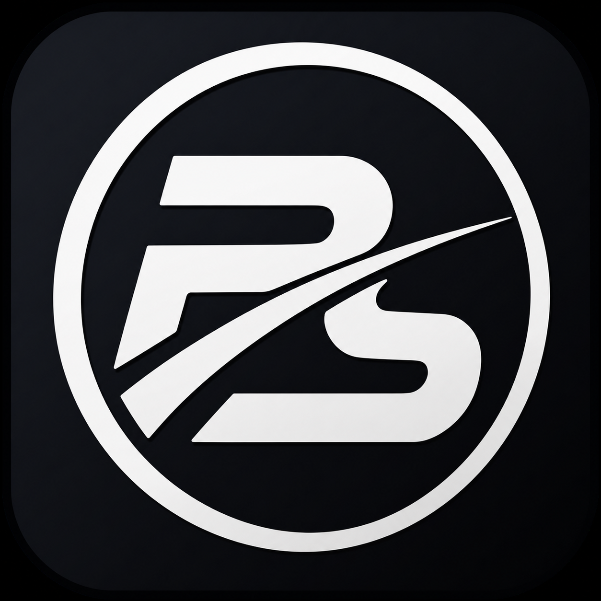

  

<h1 align="center">BimmerStein ECU Tool</h1>

<strong>BMW MS41 Programming, Diagnostics, and Recovery</strong>

  Windows desktop software for BMW MS41 programming, diagnostics, calibration work, and recovery.

  <strong><a href="https://github.com/CAATZ/BimmerStein-ECU-Tool/releases">Windows Releases</a></strong>
  &nbsp;&middot;&nbsp;
  <a href="manual/USER_MANUAL.md">User Manual</a>
  &nbsp;&middot;&nbsp;
  <a href="https://github.com/CAATZ/BimmerStein-ECU-Tool/issues">Issues &amp; Feedback</a>

  <code>Windows x64 / x86</code>&nbsp;&nbsp;
  <code>BMW MS41 focused</code>&nbsp;&nbsp;
  <code>GPL-3.0-only</code>

---

  <strong>OFF-ROAD USE ONLY</strong>

## Overview

Local development build `0.1.0b18` includes Launch Control V11 for all supported
MS41 families, Ignition Cut V11 for MS41.3 (V10 for MS41.0/.1/.2), Soft-BSL V12,
and CalGuard V6. See [release notes](RELEASE_NOTES.md) for validation limits.

BimmerStein ECU Tool brings BMW MS41 flashing, diagnostics, configuration, patching, and recovery together in a single Windows application:

- Read and write 256 KB full ROMs and 24 KB tune files.
- Automatically select Soft-BSL, stock native-fast DS2, or normal DS2.
- Correct the applicable MS41 checksums before flashing.
- Honor the operator's backup and host read-back Verify selections.
- Preserve an active recovery session after a post-erase write failure.
- Read ECU information, DTCs, live data, coding, VIN, and EWS information.
- Diagnose and code supported vehicle modules from built-in exact profiles.
- Run guided manual/automatic transmission conversion for exact supported vehicle profiles, with
  preflight, durable recovery records, and final verification.
- Analyze ROMs with user-managed definitions and a detachable parameter table.
- Convert, catalogue, and patch ROM images offline.
- Install and use Soft-BSL for supported high-speed operations.
- Recover an unbootable ECU through the separate hardware-BSL workflow.

Beta 18 (`0.1.0b18`) updates CalGuard recovery, ignition cut and launch control,
improves patch configuration, and removes unnecessary delay before Soft-BSL entry.
Windows installers and complete portable packages are available for x64 and x86.
Choose x64 for a 64-bit PC or x86 for 32-bit Windows. Keep the entire installed
or extracted folder together. Required application runtimes are included.

Installing this application does not update ECU firmware automatically.

## Safety

> [!IMPORTANT]
> **OFF-ROAD, COMPETITION, RESEARCH, AND BENCH USE ONLY.** Do not use this software to modify a
> vehicle operated on public roads. The user is responsible for compliance with applicable
> emissions, safety, registration, and other laws.

> [!CAUTION]
> ECU programming can leave an ECU unbootable if power, wiring, or communication is interrupted.
> Use a stable regulated power supply, confirm the target file and flash geometry, and keep a
> hardware-BSL recovery path available for advanced work.

If a write fails after erase begins, **keep ignition ON, leave the adapter connected, and keep the
application open**. Use **Retry Flash Recovery** while the retained native-fast or Soft-BSL session
is available.

After a successful Flash-tab write, follow the displayed ignition procedure: ignition OFF, wait at
least 10 seconds, then ignition ON.

## Supported workflows

| Area | Scope |
| --- | --- |
| ECU software | BMW MS41.0, MS41.1, MS41.2, and MS41.3 |
| Normal diagnostics | BMW DS2 over K-Line, 9600 baud, 8E2 |
| Vehicle coding | 50 built-in module targets and 178 exact profiles across supported E36, E38, E39, and E46 modules; known ADS/L-line-only variants are identified before access |
| Transmission conversion | Reviewed K-line-accessible E36 Compact/E39 MS41-family, E46 MS42 AM51, and late E46 MS43 EV51 profiles |
| Stock fast transfer | Native-fast DS2 through FTDI D2XX, requesting the ECU-exact 187,500 baud rate |
| Soft-BSL | Persistent loader and Intel/AMD RAM agents |
| Hardware BSL | Intel 28F200 and AMD/JEDEC 29F200/29F400 through a separate direct ASC0 connection |
| Image sizes | 256 KB full ROM and 24 KB tune |

Hardware-BSL and armed Soft-BSL boot-region operations are advanced recovery-sensitive workflows.
Intel 28F200 erase/program also requires the correct external VPP/RP# supply; AMD/JEDEC parts do
not use that Intel programming-voltage requirement.

For the bench wiring and hardware connections used by the BSL-Unbricker tab, see
[CAATZ/MS41-BSL-Unbricker](https://github.com/CAATZ/MS41-BSL-Unbricker).

## Soft-BSL: persistent high-speed ECU access

Soft-BSL is one of the primary features of BimmerStein ECU Tool. It installs a small persistent
loader in ECU flash using the guided installation workflow. When requested, that loader accepts
the matching Intel or AMD/JEDEC agent over the existing DS2 K-Line connection, loads it into ECU
RAM, and transfers control to it for higher-speed reads and writes. No separate bench connection is
required for normal Soft-BSL operation after installation.

The installer identifies the ECU and flash family, validates and prepares the target image, creates
the temporary installation entry, writes and verifies the persistent loader, and confirms normal
DS2 communication after the guided ignition sequence. The temporary entry is removed after a
successful installation; subsequent operations use the persistent loader and the current bundled
RAM agents.

Once detected, Soft-BSL is selected automatically by the Flash tab. It supports optimized full-ROM
and tune reads and writes, starts at the highest supported baud tier, and can retry a lower tier only
before erase begins. If a write fails after erase may have started, the application retains the live
RAM-agent session and prepared image for a same-session recovery attempt instead of reopening the
port or changing transports.

> [!WARNING]
> Soft-BSL installation modifies ECU firmware and is recovery-sensitive. Use stable power, follow
> every ignition prompt exactly, do not interrupt an active write, and keep a hardware-BSL recovery
> path available. Golden-bank, cross-bank, and armed boot-region operations are advanced workflows,
> not routine substitutes for normal tune or program writes.

## Live data and logging

The Live Data tab displays and records core MS41 engine values, including RPM, temperatures,
throttle position, airflow, ignition and knock values, VANOS position, injector pulse width, fuel
trims, load, battery voltage, oxygen-sensor and MAF voltages, and operating states. When the MS41.3
wideband feature is enabled, the tab automatically adds actual AFR, target AFR, the selected
wideband input voltage, and narrowband-emulation status.

The RAM addresses and conversions use ECU-specific MS41 logger definitions.
The connected ECU ID selects the appropriate address family; values without a
verified mapping remain unavailable instead of using a guessed address. These profiles are part of
the application. The Live Data tab can also select a compatible logger XML or return to the bundled
definition. Stop polling before changing definitions.

**Fast Telegram Mode** registers up to 24 RAM addresses and retrieves them together through one DS2
batch request for the best practical sample rate. If batch polling is unsuitable for an ECU or
connection, **Standard Mode** reads the same mapped values through smaller grouped DS2 RAM requests.
Optional CSV logging writes timestamped sessions to the portable application's `logs/` directory.
Live Data polling is read-only with respect to ECU flash memory.

Live Data offers Auto, Telegram, and Standard DS2 modes, with maximum-rate polling or a selected
100–5000 ms interval. The **Values**, **Graphs**, and **Gauges / digital** tabs share channel selection,
a sample cursor, zoom and pan. **Open CSV Log…** opens a completed log in the same viewer. Live
visualization retains the latest 5,000 samples; enabled CSV logging retains the complete session.

## Transfer behavior

Normal Flash-tab reads and writes select one route:

1. Soft-BSL when a compatible persistent loader is available. It starts at the highest supported
   tier and retries lower Soft-BSL tiers only while the operation remains pre-erase.
2. Stock native-fast DS2 on a compatible stock ECU through D2XX. If its pre-erase high-rate check
   fails after the ECU is confirmed back at normal state, the complete operation restarts over
   normal DS2 at 9600.
3. Normal DS2 at 9600 when neither accelerated route is available.

Rate or route fallback is allowed before erase only. Once erase may have started, the active session
and prepared target are retained for same-session recovery instead of reopening the port or changing
transports. Both applications use the same recovery owners. After an uncertain DS2 program
reply, readback decides whether to continue, retry blank bytes, or recover the failed erase/write
phase. DS2 packet attempts are capped at three; eligible phase recovery gets one automatic replay
and one operator-requested replay. Native-fast calibration can finish a proven erased packet tail,
but does not offer the unsupported high-rate re-erase that the ECU rejects. Soft-BSL keeps its nine
packet attempts and allows one automatic sector replay only when verified data requires an erase.
Healthy writes add no recovery reads or protocol commands.

The Flash tab does not enforce a backup or host read-back verification. **Back up before write** and
**Verify after write** follow the operator's selections. ECU-side finalization remains part of
every successful DS2 write and is separate from optional host byte-for-byte verification.
Verification uses one cumulative progress indicator across all selected regions.

New AMD TOP-bank images include resident DS2 protection: calibration writes remain allowed,
but full/program writes are rejected before erase. Forced DS2 checks the live bank marker before
optional firmware scans. For a TOP full write over Soft-BSL, **Write boot** chooses the file boot
or the live 8 KiB boot region; with file boot selected, **Graft identity** optionally preserves the
670 live production/AIF bytes. Required bytes are read once through the RAM agent before erase,
and recovery uses the same completed image. Calibration writes keep their existing behavior.
Existing ECU firmware gains this protection only after installing a newly prepared TOP image;
updating the application alone does not add it. The new guard is qualified offline, not on hardware.

## Offline Bin management

Bins catalogs reads, imports, and generated images. Select exactly two entries and choose
**Compare** for a read-only report covering SHA-256 identity, program/calibration variants,
checksums, installed patches, and changed-byte ranges. Newly cataloged files retain their original
SHA-256 so external replacement can be detected. On first load, a legacy entry without a hash is
migrated only after its stored file size matches; the file's current SHA-256 is then recorded.
An unreadable catalogue stops application startup with an error and leaves the index and backup
files unchanged.

Bins folders are real directories inside `backups/`. Creating or renaming a folder and moving
an image updates its location on disk. Existing logical folders migrate on first use, preserving
notes and provenance; filename conflicts receive a unique name instead of overwriting files.
**Browse > Open Folder** opens the filtered folder, or the selected image's folder in All images.
Imports go into the filtered folder; **Unfiled** is the `backups/` root.

Opening Bins or choosing **Browse > Refresh** discovers folders and `.bin` files managed in
Explorer. Unambiguous moves and renames retain metadata. If identical copies make a move
ambiguous, old metadata stays in the index without being assigned to a guessed file.
Externally edited files are analyzed again as imports; their former metadata is retained for
the original contents. Recovery-storage directories are excluded from this scan.

The compact toolbar groups destinations under **Open in**, file and folder management under
**Organize**, and log/recovery-file browsers under **Browse**. Folder and search filters share
one row. **Open in > Tuning Suite** is enabled only for an installed version
that advertises BIN handoff support. It opens a separate editable copy; import the saved result
back into Bins. Missing, outdated or removed installations are handled without launching them.

The EEPROM editor provides decoded fields, a Hex view, learned-knock grids, undo/redo,
named comparisons and review before applying changes. Selected invalid record checks can be
repaired explicitly; this does not establish that the stored payload is correct. EEPROM
comparison uses named fields only when both images have the same known layout.

## Firmware patches

The Patches tab detects installed and deprecated revisions, validates dependencies and byte
collisions, corrects checksums, and archives the composed image in Bins.

> [!WARNING]
> **HIGHLY EXPERIMENTAL — ON-CAR TESTING REQUIRED.** Ignition Cut V11 (MS41.3) / V10 (MS41.0-.2), and Launch Control V11
> are offline exact-byte verified but have not completed on-car validation.
> Unexpected engine behavior, stalling, failure to limit RPM, or other unintended results are
> possible. Test only in controlled off-road or bench
> conditions, begin conservatively, monitor the engine closely, and keep a verified stock image and
> recovery path available. Do not rely on these patches for engine protection or any safety-critical
> function.
>
> **IGNITION CUT HAZARD.** Ignition Cut remains experimental. It may suppress spark while
> injection continues at the stock or configured fixed pulse width. Unburned fuel can damage
> catalytic converters and exhaust components; never use it on a car with catalytic converters.
> Its fuel-adaptation and diagnostic guards are offline exact-byte verified but not vehicle-validated.

AlphaN MAF-failsafe V3 is tested. Soft-BSL V12 and boot-resident CalGuard V6 are experimental. CalGuard owns the existing nominal 40 ms startup wait on Intel and AMD. Removing CalGuard restores native startup timing while preserving Soft-BSL and the flash driver. The firmware instructions are unchanged. The current AMD MS41.0 / 29F400BB TOP image passed full installation, three cold recovery trials with exact full readbacks, and normal cold boots. Earlier Intel and AMD lower-bank results remain recorded separately; removal and standalone-update behavior has offline application coverage.
29F400BB dual-bank support is tested and working: write both halves and manage their patches and Soft-BSL.

The Patches tab shows each revision's verification status. Ignition Cut V11 is current for MS41.3;
V10 is current for MS41.0, MS41.1, and MS41.2. Launch Control V11 requires the matching current
ignition-cut revision. Faulty MS41.3 V10 and earlier deprecated revisions remain detectable for
upgrade or removal; they are not offered for a fresh installation.

The current ignition-cut patches preserve genuine electrical faults, DTC100, prior misfire
evidence, and completed catalyst results. Cut-affected learning and observation state resumes
through fresh sensor samples and native recovery paths. DTC100 can have several internal causes;
its displayed number alone does not identify the cause of a reset or communication loss.

Every Windows package includes `BimmerStein MS41 Patch Definitions.xml` beside the executable for
a compatible calibration editor. It covers the calibration items introduced by supported
patches; install the matching firmware patch before editing those tables and verify the ECU variant,
calibration ID, and patch revision. A mismatched definition can expose incorrect tables or write to
the wrong calibration addresses. Standalone Ignition Cut and Launch ignition mode have separate RPM
hysteresis and fixed injector-pulse-width settings. Launch fuel mode continues to use the stock
staged fuel limiter and ignores the Launch ignition-only settings.
Launch V11 **Always (no switch)** mode follows the same Arm Speed, Max Speed, and
Min TPS gates as clutch modes. Launch remains latched after clutch release until
Max Speed is reached or TPS falls below Min TPS. Arm Speed must be at least
1 km/h; 1 permits arming at a reported speed of zero. In fuel mode, the effective
hard threshold is the lower of the launch setting and the native hard threshold,
including when Automatic (soft cut + 96 RPM) is selected. An explicit hard RPM
below soft RPM is allowed without changing soft RPM. The effective soft threshold
is the lower of native soft and launch soft. Launch V11 adds separate fuel RPM-drop
settings for starting staged fuel restoration and clearing remaining fuel cut;
both default to **Follow stock** and are measured below effective soft RPM.
Stock hysteresis takes priority when a native limit governs or is reached, or
launch disengages during a cut, and remains selected until that cut ends.
Native staged-cut counters remain in use; ignition hysteresis affects only ignition mode.

## Installation

1. Download the Windows installer or complete portable ZIP matching your PC (x64 or x86).
2. Run the installer; it installs for the current user without requiring administrator access and
   offers an optional desktop shortcut.
3. For portable use, extract the complete ZIP and keep the entire application folder together.
4. The two editions use distinct installation directories so they can coexist. Include the complete
   package filename when describing a startup or packaging problem.
5. Install the driver for the intended FTDI adapter, then run `BimmerStein ECU Tool.exe`.

D2XX is preferred for native-fast DS2, Soft-BSL, and hardware BSL. Normal DS2 and supported
hardware-BSL paths can use the standard serial fallback where D2XX is unavailable.

User-generated data is stored beside the executable in either installation mode:

- `backups/` contains reads, prepared images, and recovery files.
- `logs/` contains session diagnostics.

Full ROMs and logs can contain VIN and ECU identity information. Treat them as private.

## Documentation and support

The build label at the lower-right opens About and can export a support ZIP containing build
information, privacy-scoped selected-Bin metadata/hash, the latest Live Data CSV, and the latest
native-fast journal. Raw ROMs are excluded. Session logs require an explicit privacy opt-in.

The illustrated manual covers normal flashing, recovery behavior, Soft-BSL, hardware BSL,
diagnostics, offline tools, patches, and final checklists:

- [Windows release downloads](https://github.com/CAATZ/BimmerStein-ECU-Tool/releases)
- [Illustrated PDF manual](output/pdf/BimmerStein-ECU-Tool-User-Manual.pdf)
- [User manual (web-readable Markdown)](https://github.com/CAATZ/BimmerStein-ECU-Tool/blob/main/manual/USER_MANUAL.md)
- [Build and release instructions](https://github.com/CAATZ/BimmerStein-ECU-Tool/blob/main/BUILDING.md)
- [Beta release notes](RELEASE_NOTES.md)
- [Hardware-BSL recovery companion](https://github.com/CAATZ/MS41-BSL-Unbricker)
- [BimmerStein Tuning Suite](https://github.com/CAATZ/bimmerstein-tuning-suite)
- [Third-party notices](THIRD_PARTY_NOTICES.md)
- [GNU GPL license](LICENSE)
- [Report a bug or request a feature](https://github.com/CAATZ/BimmerStein-ECU-Tool/issues)

Useful bug reports include the ECU software version, flash family, Windows version, interface and
driver, selected transfer mode, exact operation, last completed step, application log, reproduction
steps, and screenshots when applicable. Full ROMs and logs can contain VIN or ECU identity data;
redact personal information before sharing them.

## Run from source

See the [build guide](BUILDING.md) for the supported development environment and startup commands.

## Verify and build

The [build guide](BUILDING.md) describes the Beta 18 source checks, exact-byte firmware admission,
documentation generation, and Windows packaging commands. Offline checks do not establish behavior
on a physical ECU or vehicle.

## Project layout

| Path | Purpose |
| --- | --- |
| `gui.py` | Desktop application and guarded workflows |
| `ds2.py`, `ds2_fast_*` | Normal and native-fast DS2 protocol/session code |
| `engines/softbsl/` | Soft-BSL host, reproducible agents, manifests, and chip definitions |
| `engines/bsl/` | Hardware bootstrap recovery engine |
| `engines/patcher/` | Patch engine, descriptors, and verified patch artifacts |
| `definition_registry.py` | User-managed calibration definition registry |
| `manual/` | User-manual source and synthetic screenshots |
| `packaging/` | Windows package and documentation build scripts |
| `tests/` | Automated protocol, GUI, artifact, and packaging tests |

## Disclaimer

BimmerStein ECU Tool is experimental software intended solely for off-road, competition, research,
and bench use. It is provided "as is," without warranty of any kind, to the maximum extent
permitted by applicable law.

ECU programming, calibration changes, firmware patches, and recovery operations can cause data
loss, an unbootable ECU, engine or vehicle damage, unexpected engine behavior, or unsafe operating
conditions. The user assumes all risks associated with connecting, configuring, modifying, or
flashing an ECU and is responsible for maintaining suitable backups, stable power, and an
appropriate recovery method.

The user is solely responsible for determining whether any operation or modification is legal and
compliant with applicable emissions, safety, registration, competition, and other regulations. An
off-road designation does not establish that a particular modification is lawful.

BimmerStein ECU Tool is independent software and is not affiliated with or endorsed by BMW AG
or interface manufacturers. Nothing in this disclaimer limits the rights granted under the GNU General
Public License version 3.

## Acknowledgements

Special thanks to the people who helped shape and validate BimmerStein ECU Tool.

| Contributor | Contribution |
| --- | --- |
| [NXT-Tronic](https://github.com/NXT-Tronic) and [grantUser](https://github.com/grantUser) | Collaborative ideation and development feedback |
| **Alpine** | Beta testing |
| **roimaomanik** | Beta testing |
| **Alphamk4** | MS41.0 patch testing |
| [**kimfreding**](https://github.com/kimfreding) and **jpiccari** | MS41 CRC-16 checksum work that `engines/bsl/ms41_checksum.py` builds on |
| [**keyhana**](https://github.com/keyhana) | C166 processor tooling used to assemble and inspect firmware routines |
| [**handmade0octopus**](https://github.com/handmade0octopus) | DS2 protocol references and boot recovery idea |

## License and provenance

Copyright (C) 2026 CAATZ.

This public release is distributed under the [GNU General Public License version 3](LICENSE)
(`GPL-3.0-only`). Bundled dependencies retain their own terms; review
[Third-party notices](THIRD_PARTY_NOTICES.md) and the exact
[bundled license texts](THIRD_PARTY_LICENSES/) before distributing a binary package.
