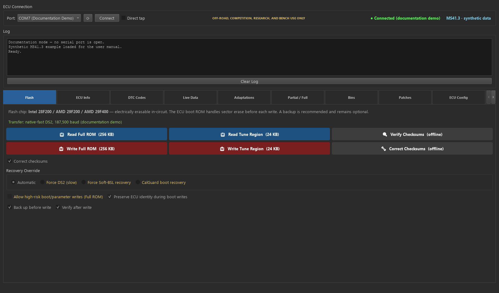
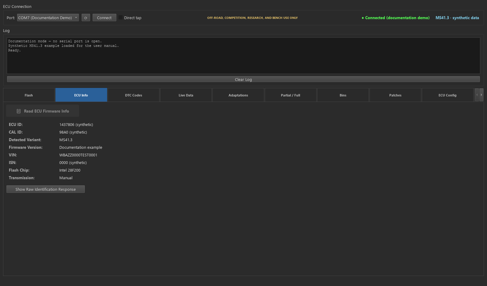
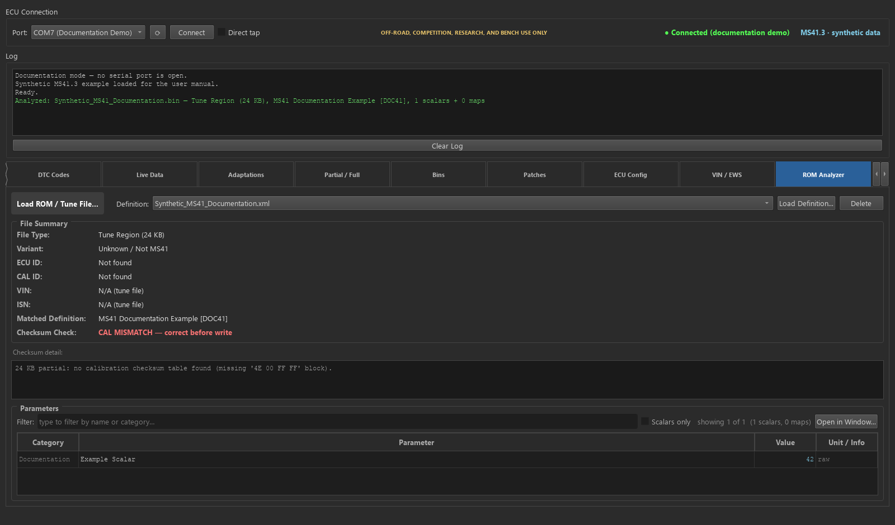
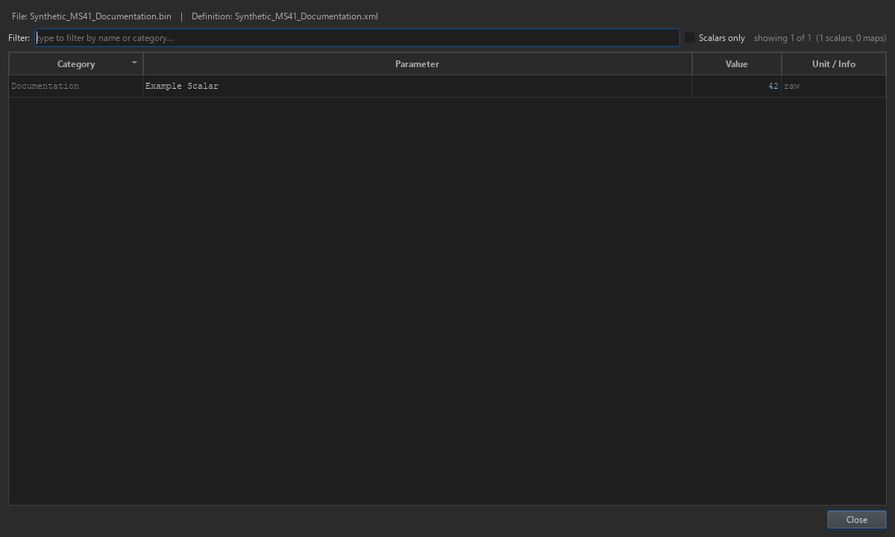
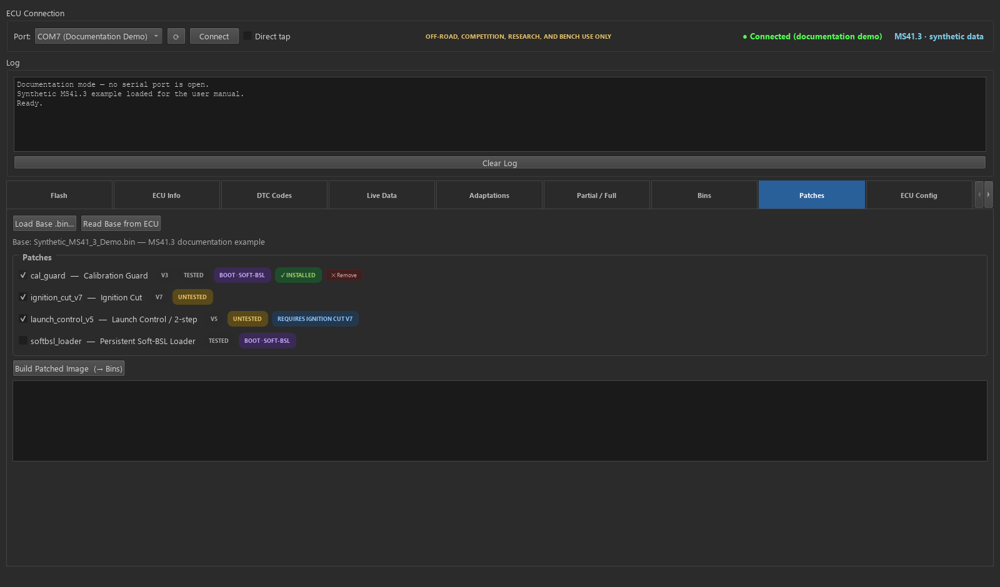
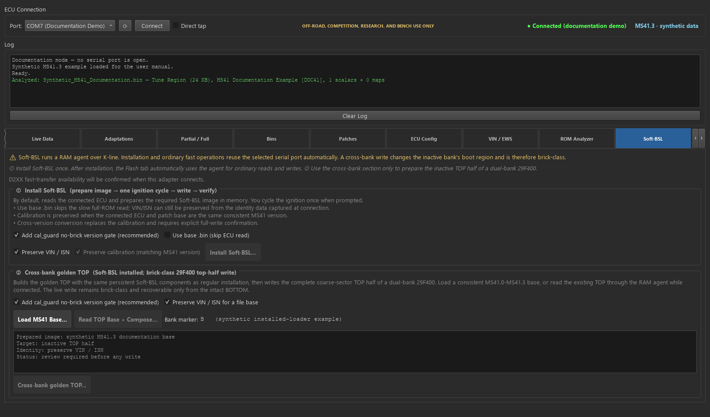
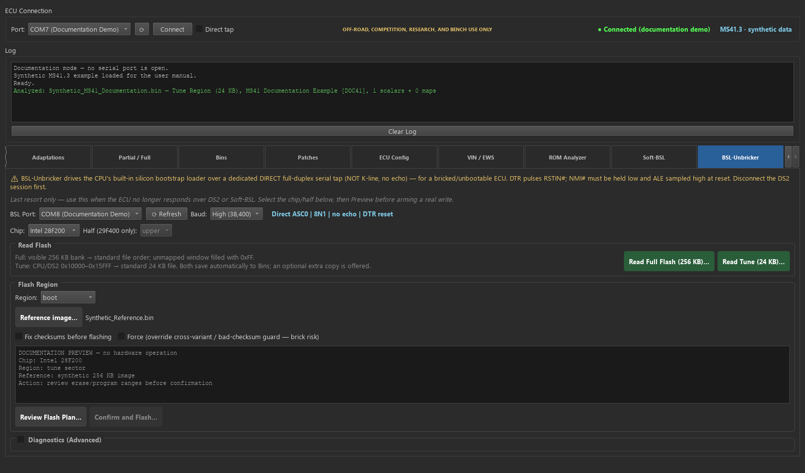

# BimmerStein ECU Tool User Manual

**BMW MS41 Programming, Diagnostics, and Recovery**

Windows x64

BimmerStein ECU Tool combines normal DS2 diagnostics, stock-ECU high-speed DS2 transfers,
Soft-BSL programming, hardware bootstrap recovery, offline ROM utilities, and firmware patch
management in one desktop application.

<!-- pagebreak -->

## Safety first

Read this section before connecting to an ECU or opening a write workflow.

> [!IMPORTANT]
> **OFF-ROAD, COMPETITION, RESEARCH, AND BENCH USE ONLY.** Do not use this software to modify a
> vehicle operated on public roads. The user is responsible for compliance with applicable
> emissions, safety, registration, and other laws.

- Use a stable, regulated vehicle or bench power supply.
- Confirm the selected COM port, wiring mode, ECU variant, flash-chip family, and file size.
- Keep ignition ON and maintain power throughout an active write.
- Do not disconnect the FTDI adapter while a flash operation is running.
- A backup is recommended, but the Flash tab respects the operator's backup selection.
- Enable read-back verification when an independent byte comparison is required.
- Keep hardware BSL recovery available when testing boot-region or experimental firmware changes.

> [!DANGER]
> If a write fails after erase has started, do not turn ignition off. Do not disconnect the
> adapter and do not close the application. Use **Retry Flash Recovery** while the retained
> high-speed or RAM-agent session is still active.

> [!WARNING]
> Hardware BSL and armed Soft-BSL boot-region writes can rewrite code required for normal ECU
> startup. A failed boot-region write can leave the ECU unbootable until hardware BSL recovery.

### After a successful flash

Every successful Flash-tab write ends with the same operator instruction:

1. Turn ignition OFF.
2. Wait at least 10 seconds.
3. Turn ignition ON.

The ignition cycle is an operational handoff, not a substitute for flash finalization or optional
read-back verification.

<!-- pagebreak -->

## Supported scope

| Area | Supported scope | Important boundary |
| --- | --- | --- |
| ECU families | BMW MS41.0, MS41.1, MS41.2, and MS41.3 | Full-ROM conversion is supported across all four variants. |
| Normal communications | BMW DS2 over K-Line, 9600 baud, 8E2 | DS2 is not KWP2000. |
| Stock fast transfers | Native-fast DS2 through an FTDI D2XX connection | The ECU-exact requested high rate is 187,500 baud. |
| Soft-BSL | Persistent loader plus RAM agents | Installation modifies firmware and requires the guided workflow. |
| Hardware BSL | Intel 28F200 and AMD/JEDEC 29F200/29F400 | Uses a separate direct ASC0 tap, not the normal K-Line connection. |
| File sizes | 256 KB full ROM and 24 KB tune | Choose the operation matching the file and intended region. |
| Host platform | Windows x64 installer or portable release | PyInstaller and Nuitka packages contain the same application features. |

### Flash-chip families

- **Intel 28F200** uses the Intel command set. Hardware-BSL erase/program operations require the
  correct external 12 V VPP/RP# supply.
- **AMD/JEDEC 29F200 and 29F400** use the AMD command set and are single-supply devices. Do not
  apply Intel VPP requirements to them.
- A 29F400 operation must also select the correct visible upper or lower half.

<!-- pagebreak -->

## Install and start

### Windows installer

1. Download either versioned Windows x64 installer.
2. Run it for a per-user installation with no administrator access required.
3. Install the driver for the intended FTDI adapter, then launch **BimmerStein ECU Tool**.

Assets whose names contain `-Nuitka` use the Nuitka backend. That installer uses a distinct product
identity and installation directory so it can coexist with the PyInstaller build. Report the
selected backend when describing startup or packaging behavior.

### Portable Windows package

1. Verify the release ZIP checksum against its matching `.zip.sha256` file when supplied.
2. Extract the complete ZIP into a writable folder.
3. Run `BimmerStein ECU Tool.exe` from the extracted application folder.

Do not move only the executable. PyQt, protocol resources, patch descriptors, and RAM-agent
payloads are stored under `_internal` in the PyInstaller package and beside the executable in the
flat Nuitka package. Keep the selected package's complete extracted folder together.

The executable may not be code-signed. Windows can show an unknown-publisher warning. Confirm the
release filename and matching `.zip.sha256` value before continuing.

### Interface driver

Install the driver for the selected FTDI adapter. D2XX is preferred for stock native-fast DS2,
Soft-BSL, and hardware BSL. When D2XX is unavailable, normal DS2 and supported hardware-BSL paths
can fall back to pyserial at their compatible rates.

### Data folders

The portable application creates mutable data beside the executable:

- `backups/` for saved reads, generated images, and recovery material.
- `logs/` for session logs and diagnostic detail.

Every package includes `BimmerStein MS41 Patch Definitions.xml` beside the executable for use with
RomRaider or BimmerStein Tuning Suite. The ROM Analyzer stores user-imported definitions under
`%LOCALAPPDATA%\BimmerStein ECU Tool\definitions\`. This keeps the selected definition available
when the portable application folder is replaced during an update.

Treat full ROMs and logs as private. They can contain a VIN, calibration identity, ECU identity,
and operation history.

<!-- pagebreak -->

## Main window

The connection bar remains visible above all tabs. It contains the normal DS2 COM selection,
Connect button, direct-tap choice, connection state, ECU variant, and transfer-mode information.
The shared log and progress controls remain visible below it.

### Normal K-Line versus direct tap

- Leave **Direct tap** clear for a normal single-wire K-Line or OBD-II adapter.
- Select it only for a full-duplex ASC0 connection that does not echo transmitted bytes.
- Choose the wiring mode before connecting. It is locked while a session owns the port.
- Hardware BSL has its own COM selector because it normally uses a separate adapter and wiring.

### Tab order

| Tab | Primary purpose |
| --- | --- |
| Flash | Full and tune reads/writes through the automatically selected transfer path. |
| ECU Info | Live identity, firmware, calibration, VIN, chip, and loader information. |
| DTC Codes | Read, describe, export, and clear diagnostic trouble codes. |
| Live Data | Poll selected MS41 values and record CSV data. |
| Partial / Full | Convert between 24 KB tune and 256 KB full images. |
| Bins | Catalog reads, backups, generated images, and notes. |
| Patches | Compose, detect, migrate, or remove supported firmware patches. |
| ECU Config | Inspect and modify supported calibration configuration switches. |
| VIN / EWS | Separate VIN editing and EWS2 alignment workflows. |
| ROM Analyzer | Inspect a BIN offline without connecting to an ECU. |
| Soft-BSL | Install and operate the persistent Soft-BSL loader. |
| BSL-Unbricker | Hardware bootstrap reads, erase, program, and recovery. |

<!-- pagebreak -->

## Flash tab

The Flash tab is the normal starting point for ECU reads and writes.

### Choose the operation

- **Read Full** saves a single-pass 256 KB full ROM.
- **Read Tune** saves the 24 KB calibration region.
- **Write Full** programs the supported full-image regions while respecting boot-write controls.
- **Write Tune** programs the calibration region.

### Automatic transfer selection

The application selects one of these routes:

1. **Soft-BSL** when the persistent loader is detected. It starts at the highest supported tier and
   retries lower Soft-BSL tiers only before erase.
2. **Native-fast DS2** on a compatible stock ECU through D2XX. A failed pre-erase high-rate check can
   restart the complete operation over normal DS2 only after the normal ECU state is confirmed.
3. **Normal DS2 at 9600** when neither accelerated route is available.

Fallback is allowed only before erase. Once erase may have started, the application retains the
active session for recovery instead of changing transports.

### Write options

- **Correct checksums** is enabled by default. MS41.3 boot and calibration checksums
  are corrected; its program checksum remains unchanged because stock program verification is
  disabled.
- **Back up before write** is optional and follows the operator's selection.
- **Verify after write** controls host-side byte-for-byte read-back verification.
- ECU-side flash finalization is independent of the optional host Verify checkbox.
- Boot/parameter writes remain separately armed because they carry a larger recovery risk.

<!-- pagebreak -->

## Failure and retained-session recovery

### Failure before erase

Before erase, Soft-BSL can retry the operation at a lower Soft-BSL baud tier. Native-fast DS2 can
restart through normal DS2 at 9600 only after the normal low-rate ECU state has been confirmed.

### Failure after erase

After erase begins, changing baud rate, reopening the port, or cycling ignition can discard the
only live recovery path. The application therefore retains:

- The D2XX native-fast session for a native DS2 write failure.
- The loaded RAM agent and port ownership for a Soft-BSL write failure.
- The exact prepared target bytes required for a same-session retry.

Follow the red recovery message exactly. Keep ignition ON and select **Retry Flash Recovery**.

### When hardware BSL is required

Use hardware BSL when normal DS2 no longer starts and no retained Soft-BSL/native session is
available. Hardware BSL runs from CPU bootstrap ROM and does not depend on valid flash contents.

> [!DANGER]
> Do not experiment with reset lines, ignition cycles, VPP, or chip-family selections during a
> retained recovery session. Preserve the session first; use hardware BSL only when the retained
> path is no longer available or cannot recover the target.

<!-- pagebreak -->

## ECU Info, DTC Codes, and Live Data

### ECU Info

Use **Read ECU Information** after connecting. The tab can report the detected ECU variant,
firmware/ECU ID, calibration ID, VIN, identity strings, flash-driver signature, flash-chip family,
and Soft-BSL marker when available.

If MS41.2 and MS41.3 identification is ambiguous, use a full image or the stronger program and
calibration markers rather than relying only on the shared ECU ID.

### DTC Codes

1. Connect through normal DS2.
2. Select **Read DTCs**.
3. Review code, occurrence/state information, and the MS41 description.
4. Export the report if it is needed for service records.
5. Clear codes only after recording them and correcting the cause.

### Live Data

Review the fixed parameter rows for plausible values and units. Fast telegram mode requests the
mapped addresses in one batch; compatible mode reads the same mapped values in smaller blocks. CSV
logging is written automatically under the application `logs/` directory while logging is enabled.

Fast telegram mode uses all 24 ECU slots. In addition to the core engine values, it reports EVAP
purge duty, front-O2 and MAF input voltages, and operating states such as closed throttle, part/full
load, deceleration fuel cut, and engine start. On MS41.3, the tool checks the runtime wideband flag
once when polling starts. If enabled, the profile automatically reports actual AFR, target AFR, and
the configured wideband input voltage; the table also identifies the selected input and whether
narrowband emulation is active.

Live Data is read-only with respect to flash memory.

<!-- pagebreak -->

## Offline files, conversion, and Bins

### ROM Analyzer

Load a 24 KB or 256 KB BIN to inspect size, version evidence, ECU/CAL identity, VIN, checksum
state, and matching definition information. No ECU connection is required.

To enable parameter matching:

1. Select **Load Definition...** and choose a RomRaider-format MS41 XML definition.
2. The tool validates the XML and copies it into the per-user definition registry.
3. Use the **Definition** list to switch between registered definitions. The selection persists
   across application restarts.
4. Select **Delete** to remove only the registered copy. The original XML is never modified.

If an imported filename already exists with identical content, the existing copy is selected. If
the content differs, the tool asks before replacing the registered copy. Flashing and dumping do
not depend on ROM Analyzer definitions.

Select **Open in Window...** in the Parameters section for a larger, resizable table. The detached
window remains modeless, has its own filter and scalar-only control, supports column sorting, and
updates automatically when the loaded BIN or selected definition changes.

Stop if the analyzer reports a hybrid program/calibration combination. A hybrid image can contain
code and calibration from different MS41 variants and is blocked from normal flashing.

### Partial / Full

- **Full to Partial** extracts the standard 24 KB tune from a 256 KB image.
- **Partial into Full** replaces the calibration in a selected full base.
- Variant conversions preserve or replace identity only according to the explicit workflow. The
  same conversion policy applies to MS41.0, MS41.1, MS41.2, and MS41.3.

### Bins

Bins catalogs files created by reads, backups, and patch composition. Entries include available
variant, type, VIN/CAL metadata, notes, and source. Use descriptive notes and preserve a known-good
original separately from edited or patched images.

Select a 24 KB tune or 256 KB full-ROM entry and choose **Open in BSL-Unbricker** to load it as the
hardware-BSL reference image and open that tab. This prepares the recovery controls only; it does
not connect to hardware, review or approve a flash plan, or flash the ECU. A tune selects the
**tune** region when available. A full ROM leaves the chip, physical half, and region unchanged for
the operator to select explicitly.

<!-- pagebreak -->

## Firmware patches

The Patches tab loads a compatible base image, checks which patches apply, detects already-installed
and deprecated revisions, validates dependencies and byte collisions, recomputes required
checksums, and archives the composed image into Bins.

### Status and migration

- **Installed** means the patch signature is present in the loaded image.
- **Deprecated - remove only** identifies a historical revision retained for safe detection and
  removal. Deprecated descriptors are not offered for a new installation.
- **Untested** means physical vehicle testing has not been completed.
- Boot-region patches require a transfer path that can actually deliver their bytes.

Ignition Cut V7, Launch Control ignition mode, and AlphaN MAF-failsafe intentionally remain
marked **Untested**.
Launch Control V4 fuel mode held its configured 4000 RPM setpoint during
vehicle testing before the MS41.3 V5 calibration relocation; V5 requires an
on-car retest. Field-failed Ignition Cut V6 remains visible only when installed
so it can be removed before V7 is applied.
Applying one requires an explicit confirmation. Do not treat offline validation as proof of safe
behavior on an engine.

> [!DANGER]
> **IGNITION CUT HAZARD.** Ignition Cut V7 is in a very early stage. It will cause fuel-related,
> misfire, and coil-related DTCs and fuel-trim issues, and the cut is extremely aggressive. Never
> use it on a car with catalytic converters; unburned fuel can destroy them.

<!-- pagebreak -->

### Bundled patch definition

The release includes `BimmerStein MS41 Patch Definitions.xml` beside the executable. Load it into
RomRaider or BimmerStein Tuning Suite to configure calibration items added by the matching patches.
Install the firmware patch first and verify the ECU variant, calibration ID, and patch revision. A
mismatched definition can expose incorrect tables or write to the wrong calibration addresses.
MS41.3 Launch Control V5 uses its dedicated `0x47E0-0x47E7` block and can be
configured with boost control. Only deprecated MS41.3 V4 overlapped boost
knock-compensation cells; remove V4 before installing and configuring V5.

### Safe composition

1. Load or read a compatible base image.
2. Remove any detected predecessor when instructed.
3. Select the required current patches and dependencies.
4. Review boot-region and Untested badges.
5. Build the image and inspect the build log.
6. Flash the archived result through the normal Flash workflow only after reviewing it.

<!-- pagebreak -->

## ECU Config and VIN / EWS

### ECU Config

ECU Config exposes supported calibration configuration bits in either file mode or connected-ECU
mode. Read the current values first, change only understood options, and write through the normal
guarded path. Some options affect checksum verification or core engine features; their warnings are
not interchangeable with the optional host read-back Verify checkbox.

Oxygen-feedback choices are resolved from the exact CAL ID because ID41, ID42, ID59, and ID85 do
not share one Byte 6 encoding. The ID12/ID60 O2 disable remains experimental and is available only
for a full-ROM target. Select **O2 Feedback Program Gate = Feedback Disabled** first; the
calibration section will then expose **Oxygen Sensors = Disabled (Experimental)**. Switching the
program gate back to enabled removes that calibration choice.

In connected-ECU mode, **Read from ECU** enables the supported program controls. If the current
connection already has an archived full read, the application reuses it. Otherwise, a program
change makes **Write to ECU** read and archive the ECU's unmodified 256 KB ROM before applying the
selected configuration. Calibration-only changes retain the faster 24 KB partial-write route.
Program changes are passed to the same guarded full-ROM writer used by the Flash tab, including
automatic Soft-BSL/native-fast/standard-DS2 selection and fallback, checksum and flash-family
checks, boot-region policy, confirmation, and optional read-back verification. The configuration
workflow never uses a different-variant base image as a firmware conversion.

### VIN editing

VIN editing is a Soft-BSL sector read-modify-write workflow. It requires a compatible installed
loader, detected flash family, D2XX connection, and a live identity-sector cache tied to the current
connection. The application changes only the packed VIN field and preserves the rest of the owning
erase sector.

### EWS2 alignment

EWS alignment is separate from VIN editing. It reads a fresh live DME ISN, applies the validated
EWS2 encoding, rechecks the value immediately before transmission, and requires the expected EWS
acknowledgement.

> [!WARNING]
> Do not assume that a cached VIN/identity read proves the current EWS state. VIN and EWS use
> separate live workflows and separate ownership checks.

<!-- pagebreak -->

## Soft-BSL

Soft-BSL installs a small persistent loader in ECU flash. The loader accepts an agent over DS2,
loads it into RAM, and transfers control to that agent for higher-speed reads and writes.

### Installation

Use the guided installer. It identifies the target, prepares the temporary entry path, validates
the current image and flash family, installs the persistent loader, and confirms normal DS2
communication after the required ignition sequence.

If the temporary Phase 1 write cannot observe the ECU-owned `E659=0xCC` readiness marker, the
application closes and releases the adapter before asking for an ignition cycle and an explicit
**Retry** or **Cancel**. Cancellation at this prompt is pre-erase: no challenge, selector, erase, or
flash command was sent. Each repeated marker timeout requires a new decision; the retry reopens a
fresh native-fast transport and never silently changes to the legacy writer.

The temporary installation entry is removed after the persistent loader is written. Subsequent
daily operations use the persistent loader and current RAM agents.

### Normal operation

- Full and tune reads use the same optimized RAM-agent path.
- Intel and AMD/JEDEC devices use their matching agent and command set.
- Program writes on MS41.2 include the checksum storage required by its enabled program CRC.
- Successful writes finalize the marker independently of optional host read-back verification.

### Cross-bank and boot writes

Golden-bank and boot-region workflows are advanced, recovery-sensitive operations. Follow the
displayed A17/bank instructions and verify the selected physical half. Do not use them as a routine
replacement for normal tune or program writes.

<!-- pagebreak -->

## BSL-Unbricker

Hardware BSL communicates through the 80C166 bootstrap loader even when flash contents are blank or
corrupt.

### Required connection

- Separate full-duplex ASC0 Tx/Rx direct tap.
- 8N1 serial framing with no K-Line echo removal.
- DTR-controlled reset pulse when wired to the supported reset circuit.
- Correct ALE/NMI bootstrap-entry straps.
- Correct chip selection and 29F400 half.

Selectable rates are 9,600, 19,200, and 38,400 baud. Use 38,400 as the preferred D2XX rate and select
19,200 or 9,600 when adapter, wiring, or signal stability requires a fallback.

### Intel VPP

Intel 28F200 erase/program requires the correct 12 V VPP/RP# supply. AMD/JEDEC parts do not. The
VPP control remains disabled until the Intel chip family is selected.

### Read and write workflow

1. Select the dedicated BSL COM port, chip, physical half, region, and rate. The application uses
   the DTR reset line for the supported entry circuit.
2. For a read, choose full 256 KB file order or the standard 24 KB tune.
3. For a write, select the reference image directly or prepare one from **Bins**, then choose
   **Review Flash Plan**.
4. Verify every physical address range and prerequisite in the preview.
5. Choose **Confirm and Flash** only when the plan is correct.
6. Monitor erase, programming, and complete physical-region read-back.
7. Remove VPP and bootstrap straps before returning to normal K-Line operation.

<!-- pagebreak -->

## Troubleshooting

### The COM port is unavailable

- Close other software using the adapter.
- Refresh the port list.
- Confirm whether the normal K-Line adapter or the separate BSL adapter is required.
- Reconnect the FTDI device and verify its Windows driver.

### D2XX is unavailable

- Confirm the selected COM port belongs to the intended FTDI device.
- Verify the FTDI D2XX driver is installed.
- Normal DS2 can use the pyserial fallback at 9600.
- Hardware BSL can use its compatible serial fallback. Native-fast DS2 requires D2XX; Soft-BSL can
  fall back to its supported low-rate serial tier when D2XX is unavailable.

### The fast-path stability check fails

If a Soft-BSL tier fails before erase, the application can retry a lower Soft-BSL tier. If a
native-fast DS2 check fails before erase and normal ECU state is confirmed, it can restart the
complete operation over normal DS2. Check adapter latency, wiring, ground, ECU voltage, and signal
integrity before retrying.

### A write failed

- If the UI says erase did not start, correct the reported connection or file problem and retry.
- If the UI says recovery is active, keep ignition ON and use **Retry Flash Recovery**.
- If the ECU no longer boots and no retained session exists, prepare the hardware-BSL connection.

### The ROM Analyzer cannot load definitions

Use **Load Definition...** to select a valid RomRaider-format MS41 XML file. Do not copy XML files
into `_internal` or any other packaged runtime directory. If a registered definition was changed or
damaged outside the application, delete it and import a known-good copy again. Confirm the BIN size
and exact ECU software identity before relying on matched values.

### Values or identity look wrong

Stop the operation. Confirm the connected ECU, file, variant, byte order, and definition. Re-read
the value through an independent path before writing anything.

<!-- pagebreak -->

## Final checklists

### Before a normal read

- [ ] ECU voltage is stable.
- [ ] The normal K-Line/direct-tap selection matches the wiring.
- [ ] The correct COM port is selected.
- [ ] Full 256 KB or tune 24 KB is intentionally selected.
- [ ] The output location does not overwrite an irreplaceable file.

### Before a normal write

- [ ] The target file size and ECU variant match the intended job.
- [ ] The detected flash-chip family is compatible with the image and path.
- [ ] Checksum correction is enabled unless there is a documented reason otherwise.
- [ ] Backup and Verify choices reflect the operator's decision.
- [ ] Stable power and hardware recovery are available.
- [ ] No other software owns the COM port.

### Before hardware BSL programming

- [ ] Direct ASC0 wiring and bootstrap straps are correct.
- [ ] Chip family and 29F400 half are correct.
- [ ] Intel VPP is active only for the Intel write phase.
- [ ] The reviewed physical address plan matches the intended region.
- [ ] The reference image is the correct size and byte order.
- [ ] A recovery plan exists if programming is interrupted.

<!-- pagebreak -->

## Disclaimer

BimmerStein ECU Tool is experimental software intended solely for off-road, competition, research,
and bench use. It is provided "as is," without warranty of any kind, to the maximum extent
permitted by applicable law.

ECU programming, calibration changes, firmware patches, and recovery operations can cause data
loss, an unbootable ECU, engine or vehicle damage, unexpected engine behavior, or unsafe operating
conditions. The user assumes all risks associated with connecting, configuring, modifying, or
flashing an ECU and is responsible for maintaining suitable backups, stable power, and an
appropriate recovery method.

The user is solely responsible for determining whether any operation or modification is legal and
compliant with applicable emissions, safety, registration, competition, and other regulations. An
off-road designation does not establish that a particular modification is lawful.

BimmerStein ECU Tool is independent software and is not affiliated with or endorsed by BMW AG,
FTDI, or RomRaider. Nothing in this disclaimer limits the rights granted under the GNU General
Public License version 3.

## Project and license

BimmerStein ECU Tool is independent software for compatible BMW MS41 workflows. It is not
affiliated with or endorsed by BMW AG, FTDI, or RomRaider.

The software is intended solely for off-road, competition, research, and bench use. It is not
designed or certified for modifying a vehicle operated on public roads.

Copyright (C) 2026 CAATZ. This public release is distributed under GNU General Public License
version 3 (`GPL-3.0-only`). Bundled dependencies retain their own terms; user-imported definition
files retain the terms of their sources. See `LICENSE.txt` and `THIRD_PARTY_NOTICES.md` in the
release package.
